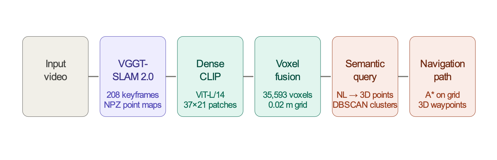
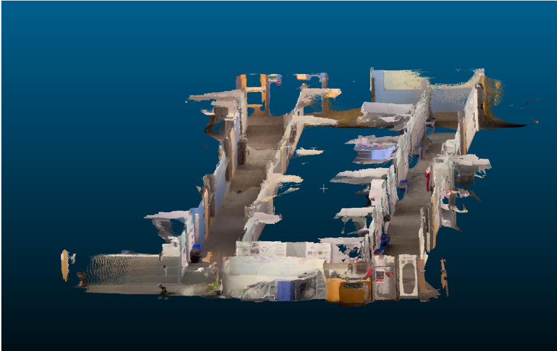
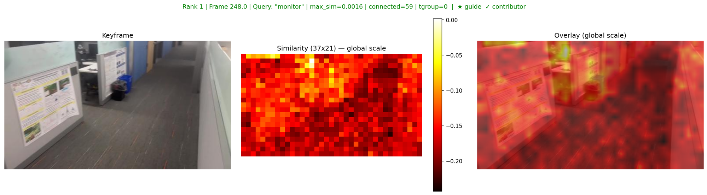
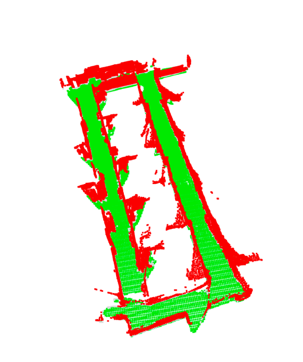
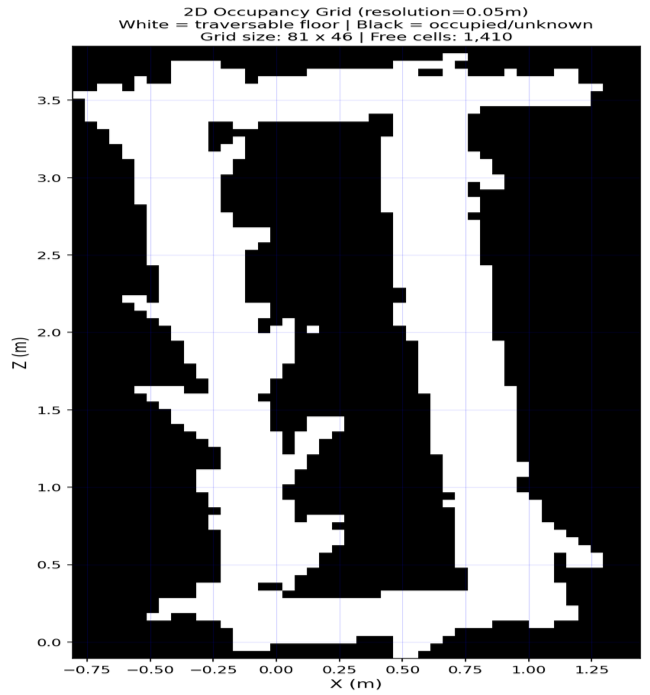
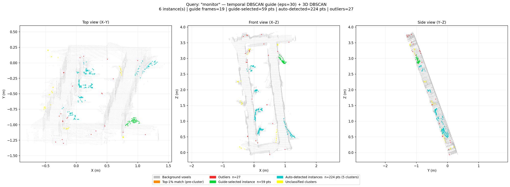
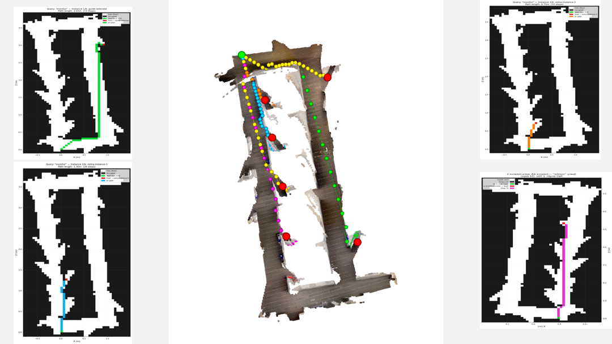
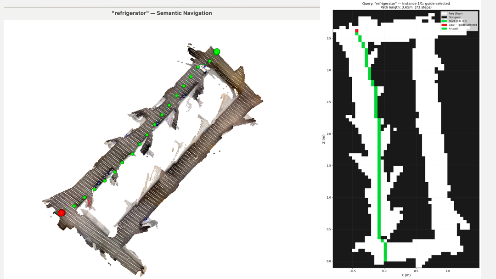
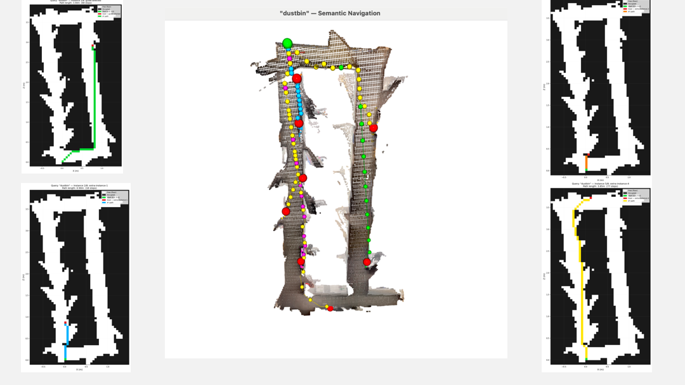
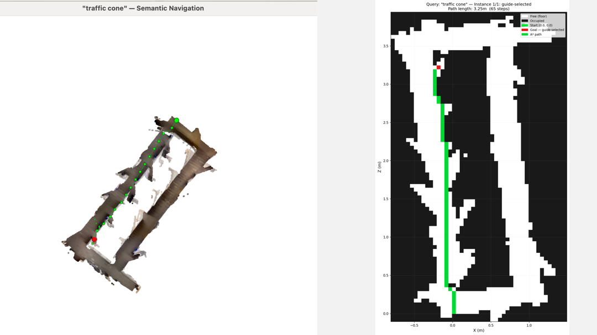

# Semantic VGGT-SLAM: Open-Vocabulary 3D Maps with Language-Guided Navigation

> **Every 3D point carries a CLIP feature vector. Ask the map a question, and the answer lights up.**

This project extends [VGGT-SLAM 2.0](https://github.com/MIT-SPARK/VGGT-SLAM) (MIT SPARK Lab) with **dense per-point language features**, enabling open-vocabulary text queries directly in 3D space. Instead of retrieving keyframes and segmenting them (VGGT-SLAM 2.0's existing semantic approach), our method attaches a 768-dimensional [CLIP](https://github.com/openai/CLIP) feature vector to every 3D point at map-build time — then any text query (e.g., *"find the refrigerator"*) highlights the relevant 3D region and plans a navigation path to it.

The approach is analogous to [LangSplat](https://github.com/minghanqin/LangSplat) (CVPR 2024), but applied to VGGT-SLAM's point cloud representation rather than 3D Gaussian Splatting.

**Course:** ECEN 689 — State Estimation for Robotics, Texas A&M University, Spring 2026
**Instructor:** Prof. Varun Murali
**Author:** Nitai Shah

---

## Table of Contents

- [Key Contributions](#key-contributions)
- [Architecture](#architecture)
- [Pipeline Overview](#pipeline-overview)
- [Repository Structure](#repository-structure)
- [Installation](#installation)
- [Usage](#usage)
- [Technical Details](#technical-details)
- [Results](#results)
- [Limitations & Future Work](#limitations--future-work)
- [References](#references)
- [License](#license)

---

## Key Contributions

1. **Dense 3D Language Field** — Every point in the VGGT-SLAM map carries a CLIP feature vector, enabling direct open-vocabulary spatial queries in 3D without keyframe retrieval.

2. **Resolution-Aligned CLIP Extraction** — CLIP features are extracted at VGGT's internal resolution (518×294), not CLIP's default 224×224, with bilinearly interpolated positional embeddings. This produces a 1:1 spatial alignment between CLIP patches and VGGT's 3D point map.

3. **Incremental Voxel Fusion** — Multi-view feature averaging via a memory-efficient voxel grid that fuses ~20 million raw points into ~35,000 voxels (~563× compression) while keeping RAM usage under 100 MB.

4. **2D-Guided 3D Cluster Selection** — A novel two-stage approach: temporal DBSCAN on 2D heatmap scores identifies guide frames, whose voxel footprints select the correct 3D cluster — solving the ambiguity that mean-similarity-based selection cannot resolve.

5. **Language-Guided Navigation** — End-to-end pipeline from text query to 3D navigation path via RANSAC floor detection, occupancy grid construction, and A* path planning, all lifted back onto the reconstructed 3D surface.

---

## Architecture

<p align="center">
  
</p>

<details>
<summary>Text diagram (click to expand)</summary>

```
                    ┌──────────────────┐
                    │  Input Sequence   │
                    │  (1920 × 1080)    │
                    └────────┬─────────┘
                             │
              ┌──────────────┴──────────────┐
              │                             │
              ▼                             ▼
    ┌──────────────────┐          ┌──────────────────┐
    │   VGGT-SLAM 2.0  │          │   CLIP ViT-L/14  │
    │   (MIT SPARK)     │          │   (OpenAI)       │
    │                   │          │                   │
    │  Per-frame:       │          │  Per-frame:       │
    │  • Point map      │          │  • Dense features │
    │    (294,518,3)    │          │    (21, 37, 768)  │
    │  • Validity mask  │          │                   │
    │  • RGB colours    │          │  @ VGGT resolution│
    └────────┬─────────┘          └────────┬─────────┘
             │                             │
             └──────────────┬──────────────┘
                            │
                            ▼
                ┌────────────────────────┐
                │  Dense Feature Lifting  │
                │                         │
                │  CLIP (21,37) → NN ×14  │
                │    → (294, 518, 768)    │
                │  Index with VGGT mask   │
                │  → per-point features   │
                └────────────┬───────────┘
                             │
                             ▼
                ┌────────────────────────┐
                │ Incremental Voxel Fusion│
                │                         │
                │  208 frames fused       │
                │  ~20M pts → ~35K voxels │
                │  Running sum per voxel  │
                │  L2-normalise at end    │
                └────────────┬───────────┘
                             │
                             ▼
              ┌──────────────────────────────┐
              │  Fused Semantic Point Cloud   │
              │  (35,593 × 768) + XYZ + RGB  │
              └──────────────┬───────────────┘
                             │
              ┌──────────────┴──────────────┐
              │                             │
              ▼                             ▼
    ┌──────────────────┐         ┌────────────────────┐
    │   Text Query      │         │   Navigation        │
    │                   │         │                     │
    │  "find the        │         │  Floor detection    │
    │   monitor"        │         │  → Occupancy grid   │
    │                   │         │  → A* path planning │
    │  → CLIP text enc  │         │  → 3D path lifting  │
    │  → 3D similarity  │         │                     │
    │  → DBSCAN cluster │         │                     │
    │  → Guide selection│         │                     │
    │  → Visualise      │         │                     │
    └──────────────────┘         └────────────────────┘
```

</details>

---

## Pipeline Overview

The system operates in four stages:

### Stage 1 — VGGT-SLAM Reconstruction

VGGT-SLAM 2.0 processes the input image sequence through a submap-based sliding window architecture. Each submap is processed by VGGT (a feed-forward vision transformer), then aligned globally via SL(4) projective transforms and a GTSAM factor graph. The output is a set of per-keyframe point clouds in a globally consistent world frame.

<p align="center">
  
  <br><em>Dense 3D reconstruction of the Office scene produced by VGGT-SLAM 2.0 (208 keyframes).</em>
</p>

### Stage 2 — Dense CLIP Feature Extraction

For each keyframe, CLIP ViT-L/14 extracts dense patch-level features at VGGT's internal resolution. The critical alignment step: VGGT resizes 1920×1080 input to 518×294 (nearest multiple of patch size 14), producing a 37×21 patch grid. We resize the input identically and interpolate CLIP's positional embeddings from 16×16 to 37×21, yielding a (21, 37, 768) feature grid with exact spatial correspondence to VGGT's point map.

<p align="center">
  
  <br><em>Dense CLIP similarity heatmaps for a single keyframe. Left: original image. Centre: patch-level similarity. Right: overlay.</em>
</p>

### Stage 3 — Lifting & Fusion

Each CLIP feature grid is upsampled via nearest-neighbour interpolation (×14) to pixel resolution, then indexed by VGGT's validity mask to assign a 768-dim feature to every valid 3D point. An incremental voxel grid accumulates running sums per voxel across all 208 keyframes, then computes the multi-view average and L2-normalises.

### Stage 4 — Query & Navigation

A text query is encoded via CLIP's text encoder. The dot product with all 3D features (negated due to inverted similarities from positional embedding interpolation) produces a per-point similarity score. Top-K% thresholding + DBSCAN spatial clustering + 2D-heatmap-guided selection localises the object. For navigation, RANSAC detects the floor plane, an occupancy grid is projected onto the XZ plane, and A* finds a path from the camera origin to the target, lifted back to 3D via nearest floor-inlier lookup.

<p align="center">
  
  &nbsp;&nbsp;
  
  <br><em>Left: RANSAC floor detection (green = floor inliers). Right: 2D occupancy grid projected onto the XZ plane.</em>
</p>

---

## Repository Structure

```
semantic-vggt-slam/
├── README.md
├── LICENSE
├── requirements.txt
├── .gitignore
│
├── scripts/
│   ├── extract_dense_clip.py        # Stage 2: Dense CLIP feature extraction
│   ├── lift_and_fuse.py             # Stage 3: Semantic lifting & voxel fusion
│   ├── query_and_visualize.py       # Stage 4a: Open-vocabulary 3D query
│   │
│   └── navigation/
│       ├── step_1_floor.py          # RANSAC floor plane detection
│       ├── step_2_create_grid.py    # 2D occupancy grid construction
│       ├── step_3_a_star.py         # A* path planning
│       ├── step_4_3d_path.py        # 3D path visualisation
│       └── visual_navigation.py     # All-in-one: query → navigate → visualise
│
├── assets/                          # Figures for this README
└── docs/                            # Additional documentation
```

---

## Installation

### Prerequisites

- Python 3.9+
- CUDA-capable GPU (for CLIP extraction; queries run on CPU)
- [VGGT-SLAM 2.0](https://github.com/MIT-SPARK/VGGT-SLAM) installed and configured (for Stage 1 reconstruction)

### Setup

```bash
# Clone this repository
git clone https://github.com/<your-username>/semantic-vggt-slam.git
cd semantic-vggt-slam

# Create conda environment
conda create -n semantic-slam python=3.10 -y
conda activate semantic-slam

# Install PyTorch (adjust for your CUDA version)
pip install torch torchvision --index-url https://download.pytorch.org/whl/cu121

# Install CLIP
pip install git+https://github.com/openai/CLIP.git

# Install remaining dependencies
pip install -r requirements.txt
```

---

## Usage

### 1. Run VGGT-SLAM Reconstruction

Follow the [VGGT-SLAM 2.0 instructions](https://github.com/MIT-SPARK/VGGT-SLAM) to process your sequence. Export per-frame point clouds as `.npz` files containing `pointcloud` (294, 518, 3), `mask` (294, 518), and `colors` (294, 518, 3) arrays. Also save the keyframe images.

### 2. Extract Dense CLIP Features

```bash
python scripts/extract_dense_clip.py \
    --input_dir  data/keyframes/ \
    --output_dir data/clip_features/
```

This produces one `<frame_name>_clip.pt` file per keyframe, each containing a `(21, 37, 768)` dense feature tensor. On an H100, extraction runs at ~15 frames/sec.

### 3. Fuse into a Semantic Point Cloud

```bash
python scripts/lift_and_fuse.py \
    --npz_dir    data/pointclouds/ \
    --pt_dir     data/clip_features/ \
    --output     data/fused_semantic_pointcloud.npz \
    --voxel_size 0.02
```

This fuses all frames into a single `fused_semantic_pointcloud.npz` containing per-voxel positions, features, colours, and observation counts.

### 4. Query the Map

```bash
python scripts/query_and_visualize.py \
    --fused   data/fused_semantic_pointcloud.npz \
    --pt_dir  data/clip_features/ \
    --kf_dir  data/keyframes/ \
    --npz_dir data/pointclouds/ \
    --query   "monitor"
```

This opens an Open3D window with the queried object highlighted in green and saves per-frame 2D heatmaps to `output/<query>/heatmaps/`.

### 5. Language-Guided Navigation (All-in-One)

```bash
# First, build the navigation prerequisites:
python scripts/navigation/step_1_floor.py \
    --fused  data/fused_semantic_pointcloud.npz \
    --output data/navigation/floor_plane.npz

python scripts/navigation/step_2_create_grid.py \
    --fused       data/fused_semantic_pointcloud.npz \
    --floor_plane data/navigation/floor_plane.npz \
    --output_dir  data/navigation/

# Then run the full pipeline:
python scripts/navigation/visual_navigation.py \
    --fused       data/fused_semantic_pointcloud.npz \
    --pt_dir      data/clip_features/ \
    --kf_dir      data/keyframes/ \
    --npz_dir     data/pointclouds/ \
    --floor_plane data/navigation/floor_plane.npz \
    --grid        data/navigation/occupancy_grid.npz \
    --query       "refrigerator"
```

---

## Technical Details

### CLIP Resolution Alignment

The most critical implementation detail. CLIP's default preprocessing center-crops input to 224×224, which for 1920×1080 images discards the left and right thirds and produces 3× lower resolution than VGGT's point map. Our approach:

| Step | Default CLIP | Our Approach |
|------|-------------|--------------|
| Input | 1920×1080 | 1920×1080 |
| Resize | Centre-crop to 224×224 | Resize to 518×294 (VGGT resolution) |
| Patch grid | 16×16 = 256 patches | 37×21 = 777 patches |
| Pos. embeddings | (257, 1024) native | (778, 1024) interpolated |
| Spatial alignment | Wrong region, wrong aspect | 1:1 with VGGT point map |

### Inverted Similarity Fix

CLIP features extracted at non-native resolution via interpolated positional embeddings produce **inverted** cosine similarities — the lowest value corresponds to the best match. The fix is simply negating the dot product:

```python
similarity = -(features @ text_feat)  # negated: highest = best match
```

This was verified across multiple object categories (recycling bin, carpet, trash can, cubicle partition, monitor, coat rack, refrigerator).

### Voxel Fusion Statistics (Office Sequence)

| Metric | Value |
|--------|-------|
| Input frames | 208 keyframes |
| Raw points per frame | ~96,000 (after mask) |
| Total raw points | ~20,000,000 |
| Unique voxels (2 cm) | 35,593 |
| Compression ratio | 563× |
| Median observations/voxel | 237 |
| Output file size | ~95 MB |

### Cluster Selection Pipeline

Mean similarity scores across DBSCAN clusters span too narrow a range to be discriminative (typical spread: 0.001). Instead:

<p align="center">
  
  <br><em>Two-stage clustering: temporal DBSCAN on 2D heatmap scores (left) identifies guide frames; spatial DBSCAN in 3D (right) localises the object.</em>
</p>

1. **2D heatmap scoring** — Score all keyframes by max patch similarity to the query
2. **Temporal DBSCAN** — Cluster top-scoring frame indices to identify coherent temporal groups (frames viewing the same object)
3. **Guide voxel keys** — Union of 3D voxel footprints from guide frames
4. **Overlap selection** — Select the 3D cluster with maximum voxel overlap with the guide set
5. **Fragment merging** — Merge nearby clusters (within 0.4 m) to handle DBSCAN fragmentation
6. **Multi-instance detection** — Identify additional instances with similar mean similarity at sufficient spatial distance

---

## Results

The pipeline was tested on an indoor **Office sequence** (208 keyframes, 1920×1080).

<p align="center">
  
  &nbsp;&nbsp;
  
</p>
<p align="center">
  
  &nbsp;&nbsp;
  
</p>
<p align="center"><em>Open-vocabulary 3D query results. Queried objects are highlighted in green; red sphere marks the goal; green sphere marks the start; coloured path shows A* navigation.</em></p>

**Confirmed working queries:**

| Query | Detection | Notes |
|-------|-----------|-------|
| "monitor" | ✅ | Multi-instance detection identifies multiple screens |
| "refrigerator" | ✅ | Single instance, strong 2D & 3D agreement |
| "coat rack" | ✅ | Thin object — 2D heatmaps strong, 3D cluster sparse |
| "dustbin" / "trash can" | ✅ | Multiple instances detected |
| "sink" | ✅ | Good localisation despite reflective surface |
| "blue recycling bin" | ✅ | Fine-grained colour+object query works |
| "carpet floor" | ✅ | Large-area query correctly spans floor region |
| "wires" | ✅ | Small/thin objects partially recovered |
| "traffic cone" | ✅ | Distinctive object, strong detection |

**Known limitation:** A systematic disconnect exists between top 2D heatmap frames and 3D cluster provenance frames. This is attributed to VGGT depth failures on thin/reflective objects — correct CLIP features exist in 2D but fail to lift into 3D due to invalid depth. Multi-frame voxel fusion mitigates this for most objects.

---

## Limitations & Future Work

- **VGGT depth failures** — Thin structures (wires, coat hooks) and reflective surfaces (monitors, sinks) produce invalid depth maps, causing correct 2D features to not lift into 3D.
- **Voxel resolution trade-off** — 2 cm voxels average features from different objects at boundaries; smaller voxels increase memory and reduce multi-view averaging.
- **CPU-only queries** — The fused map fits in RAM for CPU inference, but GPU-accelerated kNN search (e.g., FAISS) would enable real-time querying.
- **Static scene assumption** — The approach assumes a static environment; dynamic objects would require temporal feature management.
- **Navigation** — Currently uses a simple 2D A* on a binary occupancy grid; future work could incorporate semantic cost maps (e.g., "avoid the desk") and 3D obstacle avoidance.

---

## References

### Core Papers

- **VGGT** — Wang et al., *Visual Geometry Grounded Transformer*, CVPR 2025 (Best Paper)
- **VGGT-SLAM 2.0** — Maggio & Carlone, *VGGT-SLAM: Real-Time Dense RGB SLAM with Feed-Forward Geometry*, arXiv 2026
- **CLIP** — Radford et al., *Learning Transferable Visual Models from Natural Language Supervision*, ICML 2021
- **LangSplat** — Qin et al., *LangSplat: 3D Language Gaussian Splatting*, CVPR 2024

### Related Work

- **MaskCLIP** — Zhou et al., *Extract Free Dense Labels from CLIP*, ECCV 2022
- **ConceptFusion** — Jatavallabhula et al., *ConceptFusion: Open-Set Multimodal 3D Mapping*, RSS 2023
- **OpenScene** — Peng et al., *OpenScene: 3D Scene Understanding with Open Vocabularies*, CVPR 2023
- **LERF** — Kerr et al., *LERF: Language Embedded Radiance Fields*, ICCV 2023
- **DINOv2** — Oquab et al., *DINOv2: Learning Robust Visual Features without Supervision*, 2023
- **DUSt3R** — Wang et al., *DUSt3R: Geometric 3D Vision Made Easy*, CVPR 2024

---

## License

This project is licensed under the MIT License — see [LICENSE](LICENSE) for details.

VGGT-SLAM 2.0 and CLIP are subject to their respective licenses. This project is an academic extension built on top of these works.

---

## Acknowledgements

- **Prof. Varun Murali** — ECEN 689 course instructor, Texas A&M University
- **MIT SPARK Lab** — VGGT-SLAM 2.0 codebase
- **Meta AI (FAIR)** — VGGT model
- **OpenAI** — CLIP model
- **TAMU HPRC** — Compute resources (ACES H100, Grace A100 clusters)
